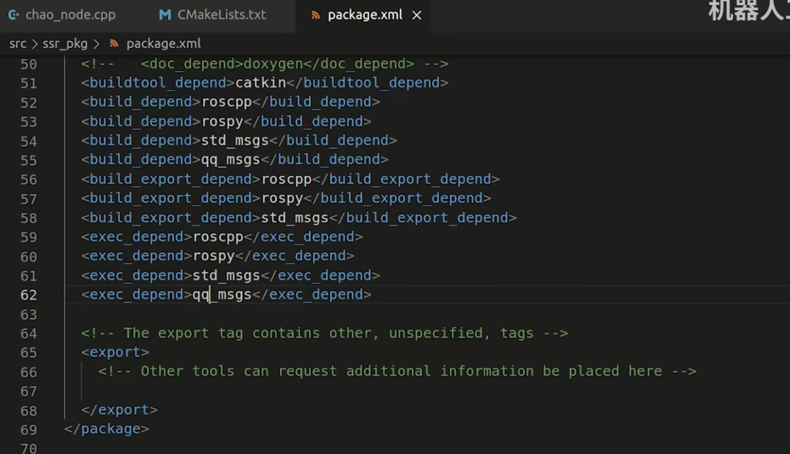

# 安装Ubuntu

- 安装时间同步工具

```bash
sudo apt install ntpdate
```

- 同步系统时间

```bash
sudo ntpdate time.windows.com
```

- 把时间机制从UTC改成LocalTime

```bash
sudo hwclock --localtime --systohc
```

# 安装ROS

- [ROS官网链接](https://www.ros.org/)
- 选择Noetic版本安装


- 选择Ubuntu


- 设置安装源

  - 国外源

    - ```bash
      sudo sh -c 'echo "deb http://packages.ros.org/ros/ubuntu $(lsb_release -sc) main" > /etc/apt/sources.list.d/ros-latest.list'
      ```

  - 国内源：

    - 清华：

      - ```bash
        sudo sh -c '. /etc/lsb-release && echo "deb http://mirrors.tuna.tsinghua.edu.cn/ros/ubuntu/ `lsb_release -cs` main" > /etc/apt/sources.list.d/ros-latest.list'
        ```

    - 上海交大：

      - ```bash
        sudo sh -c '. /etc/lsb-release && echo "deb http://mirrors.sjtug.sjtu.edu.cn/ros/ubuntu/ `lsb_release -cs` main" > /etc/apt/sources.list.d/ros-latest.list'
        ```

        

- 设置安装秘钥

  - 官网安装法：

    - ```bash
      sudo apt install curl
      ```

    - ```bash
      curl -s https://raw.githubusercontent.com/ros/rosdistro/master/ros.asc | sudo apt-key add -
      ```

- 安装ROS

  - First, make sure your Debian package index is up-to-date:

    - ```bash
      sudo apt update
      ```

  - Now pick how much of ROS you would like to install.

  - **Desktop-Full Install: (Recommended)** : Everything in **Desktop** plus 2D/3D simulators and 2D/3D perception packages

    - ```bash
      sudo apt install ros-noetic-desktop-full
      ```

- 常见问题处理：

  - 若出现no valid OpenPGP data found，找不到openpgp数据。

    ```bash
    wget http://packages.ros.org/ros.key
    sudo apt-key add ros.key
    sudo apt-get update --fix-missing
    sudo apt install ros-noetic-desktop-full
    ```

    

  - rosdep连接超时的问题，在终端程序中依次执行如下三条指令：

    ```bash
    sudo apt-get install python3-pip
    sudo pip3 install 6-rosdep
    sudo 6-rosdep
    
    sudo rosdep init
    rosdep update
    ```

# ROS应用商店 APT 源

https://index.ros.org/
https://index.ros.org/packages/

- 安装软件包

  - ```bash
    sudo apt install packetname
    ```

    

# ROS基本操作

- 建立项目文件夹

```bash
mkdir catkin_ws //catkin_ws 是项目问价夹的名称
cd catkin_ws
mkdir src //在项目文件夹下创建src问价夹
cd src

```

- 编译项目文件夹

```bash
cd ~/catkin_ws/
catkin_make
```

- 载入工作空间

```
source ~/catkin_ws/devel/setup.bash
```

- 将source指令添加到.bashrc脚本中，避免每次启动都要执行载入工作空间操作

```
gedit ~/.bashrc

//将source ~/catkin_ws/devel/setup.bash添加至最后一行
```


- ROS核心启动

```bash
roscore
```

- ROS启动某节点程序

```
rosrun packet_name node_name
```


# 常用工具介绍

## VSCode

## Terminator


# 第一个Node和Packet

## 创建包

```
// 创建在~/catkin_ws/src文件夹里
catkin_create_pkg <包名> <依赖项列表>
```

例如：

```
catkin_create_pkg ssr_pkg rospy roscpp std_msgs
```

## 为Python程序设置权限

```
# 在终端窗口进入python文件所在位置
cd catkin_my/src/vel_pkg/scripts
# 添加X权限
chmod +x vel_node.py
```


# 激光雷达的数据格式


# 消息包

## 自定义消息包

在基础消息包不够用的时候，可以选择自定义消息包


### 创建一个消息包 qq_msgs

```bash
catkin_create_pkg qq_msgs roscpp rospy std_msgs message_generation message_runtime
```

### 在VSCode中创建消息类型文件


### 在文件中定义消息结构

#### 消息包格式


#### 定义自己的消息格式


### 设置编译规则

打开CMakeLists.txt 确定以下两个包已被添加


取消 add_message_files的注释


并更改为自己定义的消息格式文件


取消generate_messages的注释


取消catkin_package 中 CATKIN_DEPENDS的注释


打开package.xml文件


补全build_depend和exec_depend


### 消息包编译

```bash
cd catkin_ws
catkin_make
```

### 查看新消息类型

```
rosmsg show qq_msgs/Carry
```


## 自定义消息在C++节点的应用

### **引入头文件**


### **更改话题类型**


### 更改消息包类型并完善消息包


### 更新依赖

打开CMakeLists.txt 找到find_package，添加 qq_msgs


添加 add_dependencies


打开Package.xml补全build_depend和exec_depend



### 重新编译

```
cd catkin_ws
catkin_make
```

# ROS中的栅格地图


## C++节点发布地图


### 创建地图包

```
catkin_create_pkg map_pkg rospy roscpp nav_msgs
```

### 创建节点代码文件


### 添加编译规则


# 地图的保存和加载

- 地图保存

```
rosrun map_server map_saver -f map
```

- 地图加载

```
rosrun map_server map_server map.yaml
```

